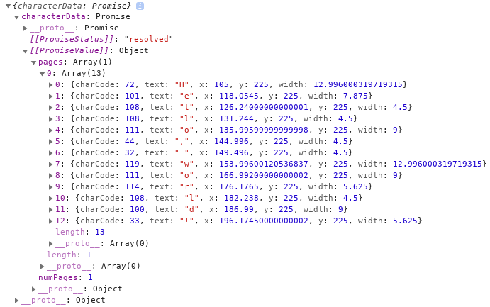
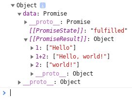

# pdf-template-parse [](./LICENSE) [](./CONTRIBUTING.md) [](https://gitter.im/pdf-template-parse/community?utm_source=badge&utm_medium=badge&utm_campaign=pr-badge&utm_content=badge)

A JavaScript frontend cross-browser compatible 'PDF parser w/ template engine' to convert pdf documents into organized data objects.

Live Demo: [Click Here](https://pdftext.netlify.com/)

## Install

Install with npm:

```bash
npm install pdf-template-parse
```

Install with yarn:

```bash
yarn add pdf-template-parse
```

## Introduction

This module exposes two functions:

1 - pdfParse (character & location extraction)

```js
import { pdfParse } from 'pdf-template-parse';
```

`pdfParse` takes a `pdf` file and returns a promise. Promise resolves all the character data (character code, text, x, y, width) found in the provided document allowing the user to process the raw data themselves.

2 - pdfTemplateParse (character extraction & templating)

```js
import pdfTemplateParse from 'pdf-template-parse';
```

`pdfTemplateParse` takes a `pdf` file and a `template` file and returns a promise. Promise resolves all the values / tables declared in the template file. (see example below for sample template file)

## Example Usage

### Example 1: helloWorldDemo.pdf

sample pdf download: [helloWorldDemo.pdf](https://pdftext.netlify.app/pdfs/helloWorldDemo.pdf)

```js
import { pdfParse } from 'pdf-template-parse';
import pdf from './samplePdf/helloWorldDemo.pdf';

const characterData = pdfParse(pdf);
console.log({ characterData });
```

Output: (console screenshot)


\*\* Note: the promise will not resolve if the browser tab is not visible.

## Example 2: **helloWorldDemo.pdf w/ template file**

Template file: [helloWorldDemo.json](https://pdftext.netlify.app/templates/helloWorldDemo.json)

```json
{
  "captureList": [
    {
      "name": "1",
      "type": "value",
      "rules": {
        "all": {
          "bounds": {
            "top": 220,
            "left": 70,
            "bottom": 230,
            "right": 140
          }
        }
      }
    },
    {
      "name": "2",
      "type": "value",
      "rules": {
        "all": {
          "bounds": {
            "top": 220,
            "left": 150,
            "bottom": 230,
            "right": 200
          }
        }
      }
    },
    {
      "name": "1+2",
      "type": "value",
      "rules": {
        "all": {
          "bounds": {
            "top": 220,
            "left": 70,
            "bottom": 230,
            "right": 200
          }
        }
      }
    }
  ]
}
```

Code:

```js
import pdfTemplateParse from 'pdf-template-parse';
import pdf from './samplePdf/helloWorldDemo.pdf';
import template from './sampleFile/helloWorldDemo.json';

const data = pdfTemplateParse(pdf, template);
console.log({ data });
```

Output: (console screenshot)



\*\* Note: the promise will not resolve if the browser tab is not visible.

# Todo

- Add tests
- Replace char_offset option with character map detection
- Add value validation.
- Add template validation.
- Add node support (either remove canvas dependency or add node canvas package)

## Authors

- **Thomas J. Herzog** - [https://github.com/tomrule007](https://github.com/tomrule007)

## License 📄

This project is licensed under the MIT License - see the [LICENSE](/LICENSE) file for details
